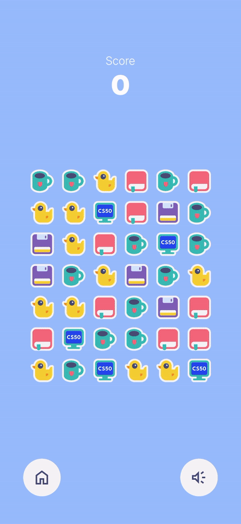
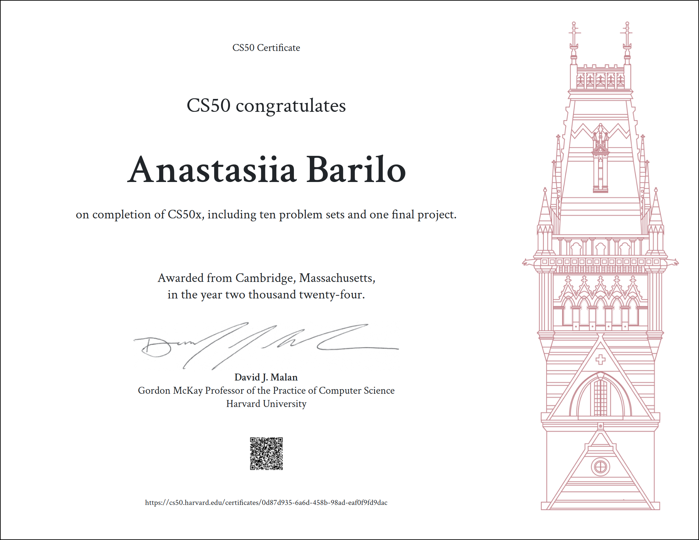

# Endless Match3

### Description:

This project is my [CS50x](https://cs50.harvard.edu/x/2024/) final submission: a simple Match3 puzzle 
game developed with the **Godot Engine 4.3** and written in **GDScript**. The game demonstrates the programming and 
problem-solving skills I gained throughout the course.

### Classic gameplay
- Match three or more tiles of the same type to score points.
- Tiles fall into place after matches, with new tiles spawning to keep the board full.

### Links
- Play the game on [itch.io](https://raydtutto.itch.io/cs50x-fp-match3)
- Gameplay video on [YouTube](https://youtube.com/shorts/FJI9hOVIjZY).

## 🛠️ Installation
1. Visit the game’s [itch.io page](https://raydtutto.itch.io/cs50x-fp-match3).
2. Play directly in your browser (desktop or mobile) or download the game files.

## 🦆 How to Play
1. Start the game from the Homepage:
    - Check your best score.
2. On the Game Board:
    - Toggle music on or off.
    - Swap adjacent tiles by clicking, dragging, or swiping to form matches of three or more.
    - Clear matches to score points while new tiles fall into place.
3. Aim to achieve the highest score possible!

## ✨ Key Features

### Scenes
1. **Homepage**:
    - Displays the best score.
2. **Game Board**:
    - Allows users to toggle background music on or off.
    - Interactive tile-based gameplay with smooth animations.
    - Ability to easily adjust height and columns through the engine without any hassle.

### Controls
- Compatible with both **mouse** (left-click only) and **touchscreen**.
- Users can _swipe_ tiles on touchscreen devices or _click-and-drag_ on desktop.

### Audio
- Looped background music with a toggle option.
- Sound effects play on tile interactions (e.g., touch, click).

### Platform Compatibility
- Works on desktop and mobile devices via **WebAssembly**.
- Optimized for **iPhone**, **iPad**, and web browsers.
- Fully resizable to support both vertical and horizontal orientations without breaking proportions.

### User Experience
- Prevents multiple simultaneous clicks.
- Restricts interaction to left mouse clicks for desktops.
- Disables board interaction during animations to ensure smooth gameplay.
- Ensures the board is not generated without matches.
- Shuffles the board if no possible matches are available.
- Once the maximum score is reached, further score updates are disabled.

## ⚙️ Technologies Used
- **[Godot Engine 4](https://godotengine.org/)** — a free and open-source game engine for creating 2D and 3D games.
- **GDScript** — the scripting language used in Godot to implement game logic.

## 📁 Project Structure
- **/assets**: Sprites, fonts, background music and sound effects.
- **/scenes**: Godot generated scene files for Homepage and Game Board.
- **/scripts**: GDScript files for core game logic.
- **project.godot**: Godot project.
- **endless_match3.zip**: Archived project on the off-chance.

### Scenes
- **/items**: 5 tile items with sprites inside.
- **/levels**: Level scene with score, buttons and where board is generating itself.
- **/tiles**: Tile white background.
- **game.tscn**: The main project scene with level holder and the HUD scene inside.
- **HUD.tscn**: Homepage scene, where user can start the game and view the score.
- **tile_bg.tscn**: Tile background holder, that loads files from "/tiles".

### Scripts Description

#### 1. `game.gd`
**Purpose**: Manages the core gameplay mechanics, such as initializing the game board, handling tile swaps, checking for matches, updating scores, and refreshing the board with new tiles.

**Key Details**:
- Handles player interactions like taps and swipes.
- Implements logic to detect and resolve matches.
- Contains functions for updating the game state, animations for tile movement, and scoring.

#### 2. `grid_container.gd`
**Purpose**: Likely handles the organization and display of game tiles within a grid layout. This file might also ensure proper alignment and spacing of game items.

**Key Details**:
- Manages grid-based operations for tiles.
- Could provide utility functions for layout or interaction purposes.

#### 3. `HUD.gd`
**Purpose**: Manages the Heads-Up Display, including user interface elements like the score display, buttons, and animations for transitions or notifications.

**Key Details**:
- Initializes UI components, such as labels and buttons.
- Plays animations for appearing UI elements.
- Emits signals to start the game and retrieves the best score from stored data.

#### 4. `item_property.gd`
**Purpose**: Defines enums and properties for items, such as color types and touch gestures. It acts as a data structure for item characteristics.

**Key Details**:
- Defines `ItemTypes` for color categorization (e.g., BLUE, GREEN, RED, YELLOW, VIOLET).
- Enumerates touch directions for swipe interactions.
- Provides reusable properties for game logic.

#### 5. `item.gd`
**Purpose**: Represents an individual game tile, including its appearance, position, and interaction logic. It also handles animations and touch-based input.

**Key Details**:
- Manages the creation of tile items and their placement on the board.
- Detects and handles player interactions like taps and swipes.
- Handles animations for item movement, appearance, and match confirmations.

#### 6. `level.gd`
**Purpose**: Controls the level-related logic, such as managing the board, buttons, and sound settings. Handles scene transitions and animations for level elements.

**Key Details**:
- Sets up and controls buttons like "Home" and "Sound."
- Toggles audio settings and changes button icons.
- Transitions back to the main menu when the home button is pressed.

## 📚 Resources
- https://docs.godotengine.org
- [Bitlytic](https://www.youtube.com/@Bitlytic)
- [Brackeys](https://www.youtube.com/@Brackeys)
- [CocoCode](https://www.youtube.com/@CocoCode)
- [Godotneers](https://www.youtube.com/@godotneers)
- [MisterTaftCreates](https://www.youtube.com/@MisterTaftCreates)

## 🌈 Acknowledgments
- [**CS50 team**](https://cs50.harvard.edu/x/2024/): For offering an exceptional introduction to computer science and programming.
- [**FesliyanStudios.com**](https://www.FesliyanStudios.com): For providing royalty-free music.
- [**Freesound.org**](https://freesound.org): For providing royalty-free sound effects:
  - Rattle Toy infant stuffet animal_1.L.wav by AGFX -- https://freesound.org/s/42938/ -- License: Attribution 4.0
  - Bobby-Car Hooting by HenryG -- https://freesound.org/s/339788/ -- License: Creative Commons 0
  - Squeaky Toy #3 by Breviceps -- https://freesound.org/s/483921/ -- License: Creative Commons 0
  - toy trumpet by Loredenii -- https://freesound.org/s/746573/ -- License: Attribution 4.0
  - Hi-Tech Error Alert 1 by miksmusic -- https://freesound.org/s/497710/ -- License: Attribution 3.0
  - tap.wav by supaFrycook2 -- https://freesound.org/s/242737/ -- License: Attribution 3.0

This project is dedicated to CS50 Rubber Ducky 🦆 Quack!

## 📝 Feedback
Your feedback is highly appreciated! Share your thoughts or report issues on the game’s [itch.io page](https://raydtutto.itch.io/cs50x-fp-match3).

## 📄 License
This project is intended for educational purposes only. All code and artwork are original creations. Audio files are used under their respective licenses.

